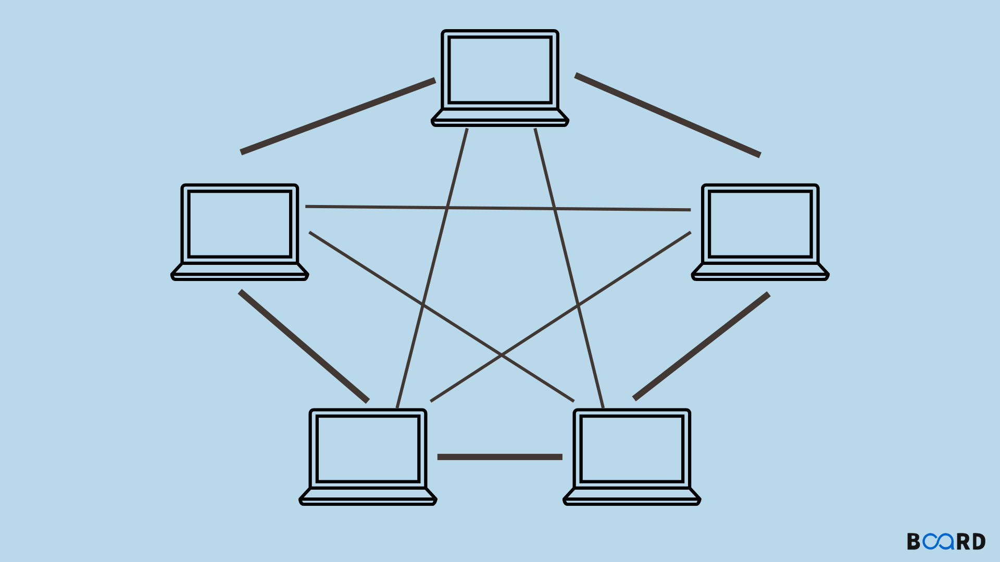

# Computer Networks and Data Communication -  Answers

### 1. What is the need for layering in network architecture, and how does it simplify the design of communication systems?

**Short Answer:**  
Layering simplifies network design by dividing complex functions into manageable segments.

**Detailed Answer:**  
Layering in network architecture organizes the communication process into distinct layers, each responsible for specific functions. This abstraction allows developers to focus on individual layers without needing to understand the entire system. It simplifies troubleshooting, enhances modularity, and enables interoperability between different systems and technologies.

**Example:**  
In the OSI model, the Application layer handles user interactions, while the Transport layer manages end-to-end communication. Changes in one layer (e.g., application protocols) can occur without affecting others (e.g., network protocols).

---

### 2. Describe the seven layers of the ISO-OSI model and the primary function of each layer.

**Short Answer:**  
The OSI model has seven layers: Application, Presentation, Session, Transport, Network, Data Link, and Physical.

**Detailed Answer:**  
1. **Application Layer:** Interfaces directly with end-user applications (e.g., HTTP, FTP).
2. **Presentation Layer:** Translates data formats, handles encryption and compression.
3. **Session Layer:** Manages sessions and controls dialogues between applications.
4. **Transport Layer:** Ensures reliable or unreliable delivery of messages (e.g., TCP, UDP).
5. **Network Layer:** Handles routing and forwarding of packets (e.g., IP).
6. **Data Link Layer:** Provides node-to-node data transfer, error detection, and correction.
7. **Physical Layer:** Transmits raw bits over physical media (e.g., cables, signals).

**Example:**  
When a user accesses a website, the request travels through all seven layers of the OSI model, ensuring proper communication.

---

### 3. What are the main differences between the TCP/IP model and the OSI model in terms of layers and functionality?

**Short Answer:**  
The TCP/IP model has four layers, while the OSI model has seven, with different functionalities.

**Detailed Answer:**  
The TCP/IP model consists of:
1. **Application Layer:** Combines OSI’s Application, Presentation, and Session layers.
2. **Transport Layer:** Similar to OSI, responsible for end-to-end communication.
3. **Internet Layer:** Equivalent to OSI’s Network layer, handling routing.
4. **Link Layer:** Combines OSI’s Data Link and Physical layers.

In contrast, the OSI model provides a more detailed framework, allowing for a clearer separation of functions.

**Example:**  
TCP/IP is widely used in real-world applications like the Internet, while the OSI model serves as a theoretical framework.

---

### 4. What is TCP/IP? Explain with a detailed diagram.

**Short Answer:**  
TCP/IP is a set of communication protocols used for the Internet and similar networks.

**Detailed Answer:**  
TCP/IP (Transmission Control Protocol/Internet Protocol) is the foundational suite of protocols for the Internet. It consists of four layers:
1. **Application Layer:** Supports application and end-user processes (HTTP, FTP).
2. **Transport Layer:** Manages communication between hosts (TCP ensures reliable transmission; UDP allows for faster, connectionless transmission).
3. **Internet Layer:** Routes packets across networks (IP handles addressing and routing).
4. **Link Layer:** Controls the physical transmission of data.

**Example:**  
A diagram illustrating these layers would show each layer's protocols and how they interact to enable communication.

---

### 5. Give the internet checksum method with a suitable example.

**Short Answer:**  
The Internet checksum method uses a simple addition algorithm to detect errors in data transmission.

**Detailed Answer:**  
The checksum involves summing up 16-bit words in the data and taking the one's complement of the final sum. If the result is zero, the data is considered error-free. If not, an error may have occurred.

**Example:**  
For the data sequence: 11000011 10101010 11110000,
1. Break into 16-bit words: 11000011 10101010 and 11110000.
2. Sum the words: 11000011 + 10101010 + 11110000 = 1 01111001.
3. Take the one's complement: 10000110 is the checksum.

---

### 6. What are some common error detection techniques used in data transmission, and how do they work?

**Short Answer:**  
Common error detection techniques include parity checks, checksums, and cyclic redundancy checks (CRC).

**Detailed Answer:**  
1. **Parity Checks:** Adds a parity bit to ensure the total number of 1s is even (even parity) or odd (odd parity).
2. **Checksums:** Calculates a sum of data segments, as described earlier, to verify integrity.
3. **Cyclic Redundancy Check (CRC):** Uses polynomial division to produce a checksum, ensuring high reliability for detecting changes in raw data.

**Example:**  
CRC is often used in network communications and storage devices to ensure data integrity.

---

### 7. What is framing in data communication, and why is it essential for the reliable transfer of data?

**Short Answer:**  
Framing is the process of breaking data into manageable packets or frames for transmission.

**Detailed Answer:**  
Framing encapsulates packets of data with headers and trailers that contain control information. It helps identify the beginning and end of each frame, enabling proper synchronization and error detection. This structure is crucial for reliable communication, as it facilitates flow control and data integrity.

**Example:**  
In Ethernet networks, frames are used to encapsulate packets, allowing devices to identify the source, destination, and type of data being transmitted.

---

### 8. Can you describe the different types of framing methods, such as fixed-size framing and variable-size framing, and their advantages?

**Short Answer:**  
Framing methods include fixed-size framing and variable-size framing, each with its advantages.

**Detailed Answer:**
1. **Fixed-Size Framing:** All frames are of the same size. This simplicity facilitates easier processing and reduces the chance of fragmentation.
   - **Advantages:** Predictable frame size leads to simpler design and easier implementation.
2. **Variable-Size Framing:** Frames can vary in size, accommodating different amounts of data.
   - **Advantages:** More efficient use of bandwidth, as it can handle different data sizes more effectively.

**Example:**  
Ethernet typically uses fixed-size frames, while protocols like TCP can use variable-size frames based on the amount of data being sent.

---

### 9. What is Hamming distance? Find the Hamming codeword for the data 1001011 using even bit parity.

**Short Answer:**  
Hamming distance measures the difference between two binary strings; it indicates the number of bit positions in which the strings differ.

**Detailed Answer:**  
To find the Hamming codeword for the data 1001011 using even parity:
1. Calculate the number of parity bits needed. For data of length \(k\), the number of parity bits \(p\) satisfies \(2^p \geq k + p + 1\). Here, \(k = 7\) (1001011), so \(p = 4\).
2. Place the data bits and reserve positions for parity bits.
3. Calculate the parity bits to ensure even parity across designated bits.

**Example:**  
For data 1001011, the calculated Hamming codeword is 101001011, where parity bits are placed at positions 1, 2, 4, and 8.

---

### 10. Explain the various types of networks.

**Short Answer:**  
Types of networks include LAN, WAN, MAN, PAN, and WLAN.

**Detailed Answer:**
1. **LAN (Local Area Network):** Covers a small geographical area, like a home or office.
2. **WAN (Wide Area Network):** Spans large geographical distances, connecting multiple LANs (e.g., the Internet).
3. **MAN (Metropolitan Area Network):** Covers a city or a large campus, larger than a LAN but smaller than a WAN.
4. **PAN (Personal Area Network):** A small network, typically within a range of a few meters, used for connecting personal devices (e.g., Bluetooth).
5. **WLAN (Wireless Local Area Network):** A LAN that uses wireless communication.

**Example:**  
A home Wi-Fi network is a WLAN, while the Internet is a WAN.

---

### 11. Give the difference between connection-oriented and connectionless networks.

**Short Answer:**  
Connection-oriented networks establish a dedicated connection before data transmission, while connectionless networks send data without prior setup.

**Detailed Answer:**  
- **Connection-Oriented:** Protocols like TCP establish a reliable connection, ensuring data is received in order and without errors.
- **Connectionless:** Protocols like UDP send packets independently, with no guarantee of delivery or order, which reduces overhead and increases speed.

**Example:**  
TCP (connection-oriented) is used for web browsing, while UDP (connectionless) is used for live video streaming.

---

### 12. Explain various network topology with diagrams.

**Short Answer:**  
Network topologies include bus, star, ring, mesh, and hybrid topologies.

**Detailed Answer:**
1. **Bus Topology:** All devices share a single communication line. (Simple and cost-effective, but if the main cable fails, the network goes down.)
   
   

2. **Star Topology:** All devices are connected to a central hub or switch. (Easy to manage and troubleshoot; failure of one cable does not affect others.)
   
    

3. **Ring Topology:** Each device is

 connected to two others, forming a circle. (Data travels in one direction; failure of one device can disrupt the network.)
   
    

4. **Mesh Topology:** Every device is interconnected. (High redundancy and reliability, but expensive and complex.)
   
    

5. **Hybrid Topology:** Combines two or more topologies. (Flexibility and scalability; can leverage advantages of multiple topologies.)
   
   

---

### 13. What is guided media and unguided media?

**Short Answer:**  
Guided media uses physical pathways for data transmission, while unguided media transmits data through the air or space.

**Detailed Answer:**  
- **Guided Media:** Includes cables like coaxial cables, fiber optics, and twisted pair cables. The data travels through these physical mediums, providing high reliability and security.
- **Unguided Media:** Includes wireless transmission methods such as radio waves, microwaves, and infrared signals. It is suitable for mobile communication but may face interference and security challenges.

**Example:**  
Fiber optic cables represent guided media, while Wi-Fi represents unguided media.

---

### 14. What is Zigbee, Wi-Fi, CSMA-CD?

**Short Answer:**  
Zigbee is a low-power wireless protocol for IoT; Wi-Fi is a wireless networking technology; CSMA-CD is a network protocol for collision detection.

**Detailed Answer:**
- **Zigbee:** Designed for low-power, low-data-rate applications, commonly used in smart home devices and automation systems. It operates on the IEEE 802.15.4 standard.
  
- **Wi-Fi:** A widely used wireless networking technology that allows devices to connect to the Internet. It operates on various standards (IEEE 802.11) and supports high data rates over moderate distances.
  
- **CSMA-CD (Carrier Sense Multiple Access with Collision Detection):** A network protocol for Ethernet networks that prevents collisions during data transmission. Devices listen before transmitting and detect collisions, waiting for a random time before retrying.

**Example:**  
Zigbee is often used in smart lighting systems, Wi-Fi in home networks, and CSMA-CD in wired Ethernet networks.

---

### 15. Write a short on access technique.

**Short Answer:**  
Access techniques manage how devices communicate over a shared medium.

**Detailed Answer:**  
Access techniques are methods used to control how data is transmitted over a network. Common techniques include:

- **CSMA/CD (Carrier Sense Multiple Access with Collision Detection):** Used in wired networks (e.g., Ethernet), where devices listen before transmitting to avoid collisions.
  
- **CSMA/CA (Carrier Sense Multiple Access with Collision Avoidance):** Used in wireless networks (e.g., Wi-Fi) to prevent collisions by waiting for a clear channel before transmitting.
  
- **Token Ring:** A token is passed around the network; only the device holding the token can transmit, eliminating collisions.

**Example:**  
Wi-Fi uses CSMA/CA to manage how multiple devices share the airwaves effectively.
